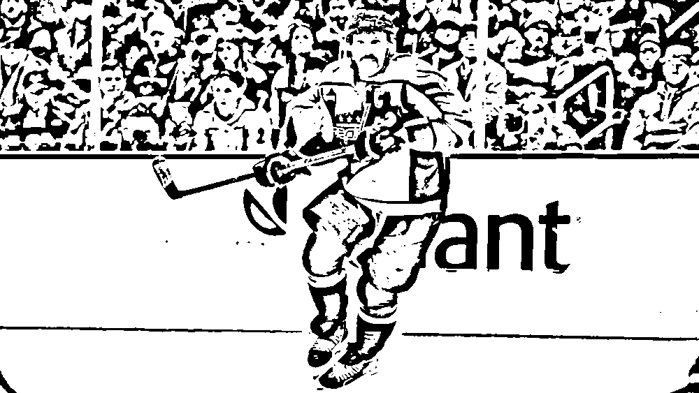
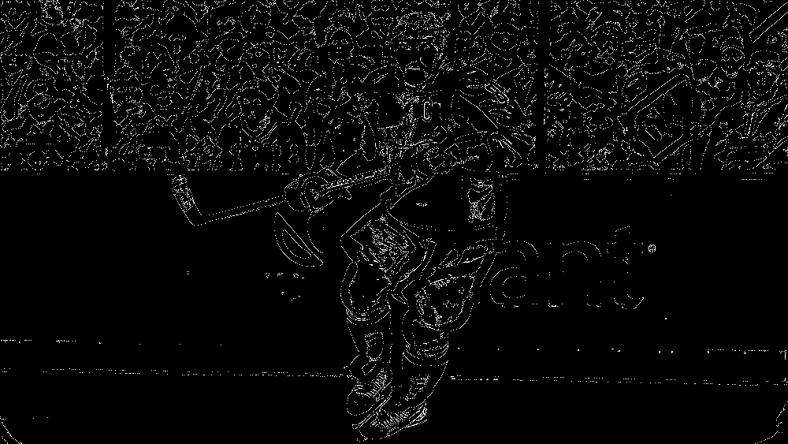
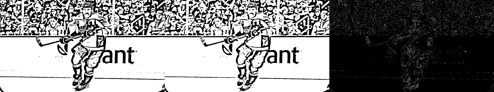
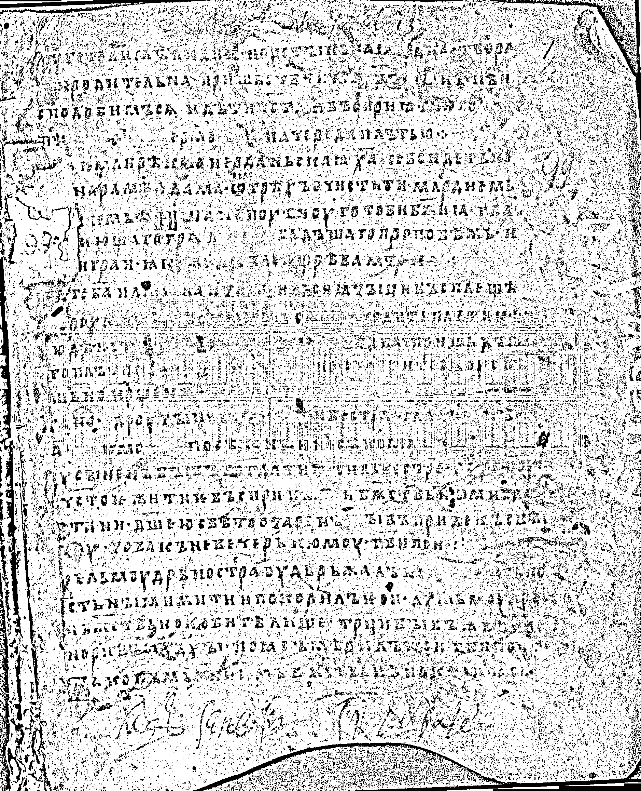
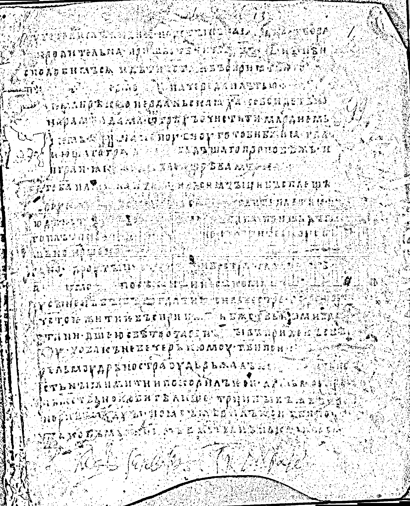
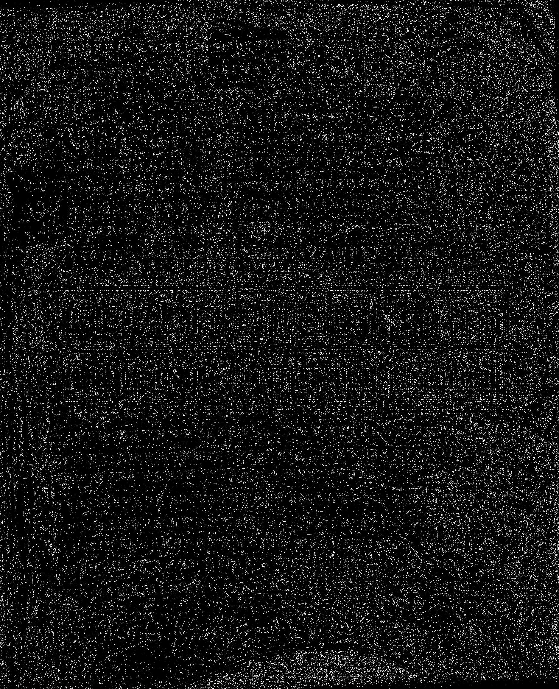
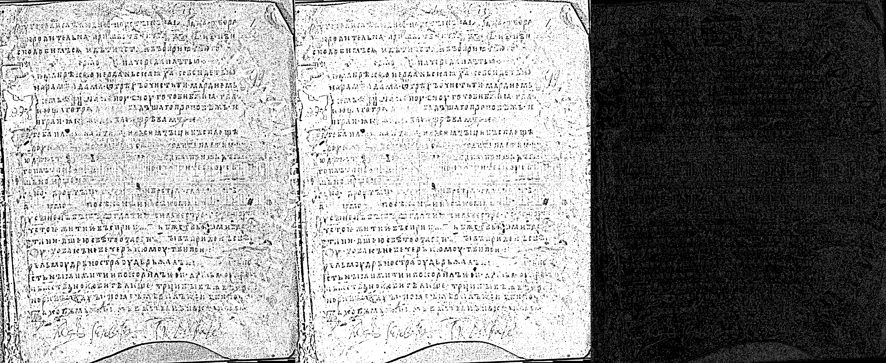

# Лабораторная работа №3
## Фильтрация изображений и морфологические операции

### Вариант
Для варианта `11` по таблице из задания нужен ранговый фильтр для бинарного изображения с окном `3 x 3` и маской `холм`.

```text
1 2 1
2 4 2
1 2 1
```

Используется ранг `12/16`.

### Что делается в работе
1. Берутся бинарные результаты из второй лабораторной.
2. Для каждого изображения применяется ранговый фильтр варианта `11`.
3. Для наглядности строится `XOR`-разность между входом и результатом.

### Исходные данные
В работе использованы бинарные изображения, полученные во второй лабораторной при обработке с окном `25 x 25`:

- `01_original_binary_25x25.png`
- `zhest_01_binary_25x25.png`

На вход фильтра подаются именно бинарные изображения.

### Теория
Ранговый фильтр для бинарных изображений работает как локальное взвешенное голосование по окрестности.

Для окна `3 x 3` считается такая сумма:

`S = 1*b1 + 2*b2 + 1*b3 + 2*b4 + 4*b5 + 2*b6 + 1*b7 + 2*b8 + 1*b9`

где:
- `1` означает черный пиксель
- `0` означает белый пиксель

Правило фильтрации:
- если `S >= 12`, пиксель становится черным
- иначе пиксель становится белым

Разностное изображение по заданию строится через `XOR`:
- белый пиксель на разности означает, что значение изменилось
- черный пиксель означает, что пиксель осталось прежним

### Исходные изображения

### Результаты

#### Изображение `01_original_binary_25x25`

| Бинарный вход из лабы 2 | После фильтра варианта `11` |
| --- | --- |
|  |  |

| `XOR`-разность | Общая сводка |
| --- | --- |
|  |  |

Фильтр убирает часть одиночных темных точек и мелких артефактов на фоне. При этом основные штрихи текста сохраняются, хотя самые тонкие элементы могут слегка упрощаться.

#### Изображение `zhest_01_binary_25x25`

| Бинарный вход из лабы 2 | После фильтра варианта `11` |
| --- | --- |
|  |  |

| `XOR`-разность | Общая сводка |
| --- | --- |
|  |  |

На странице из выборки «Жесть» изменения обычно заметнее, потому что фон шумнее. По `XOR` хорошо видно, какие участки фильтр исправил локально.

### Вывод
Для варианта `11` к бинарным изображениям применен ранговый фильтр с маской `холм`, окном `3 x 3` и рангом `12/16`.

Для каждого изображения показан сам результат и `XOR`-разность, как требуется в задании. Такой фильтр подходит для аккуратной чистки бинарного шума и мелкой бахромы, не разрушая основную структуру текста.
